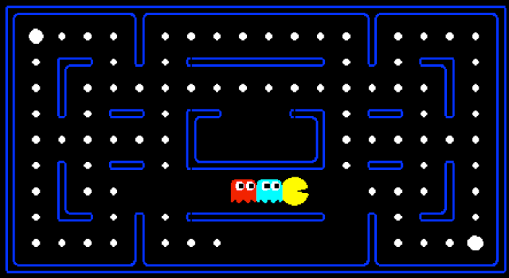
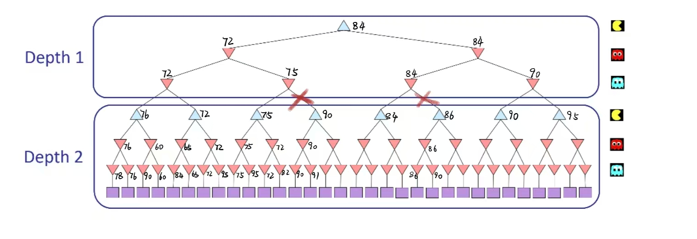

# 课程项目1：多智能体搜索

**李然（241880573、241880573@smail.nju.edu.cn）**  

## 摘要

在本次课程项目中，我为Pacman游戏设计了多智能体搜索算法，包括极小化极大（Minimax）搜索、Alpha-Beta剪枝、期望最大（Expectimax）搜索，并实现了更好的评价函数（Evaluation Function）。这些算法适用于任意数量的幽灵对手，我在multiAgents.py文件中完成了相应类的实现。Minimax算法通过递归构建搜索树来选择最佳行动；Alpha-Beta剪枝优化了搜索效率；Expectimax考虑了幽灵的随机行为；评价函数综合考虑了分数、食物距离、幽灵威胁等因素。实验结果显示，这些算法在smallClassic地图上表现良好，Alpha-Beta剪枝显著提高了速度，Expectimax在trappedClassic地图上胜率约50%，评价函数使Pacman在随机幽灵场景下平均得分约1200分。

**关键词**：多智能体搜索；极小化极大；Alpha-Beta剪枝；期望最大；评价函数

## 1 引言

Pacman游戏是一个经典的多智能体对抗环境，其中Pacman需要躲避幽灵并吃掉食物。本项目要求实现对抗搜索算法来指导Pacman的行动。项目代码基于UC Berkeley的Pacman AI框架，我在multiAgents.py中实现了MinimaxAgent、AlphaBetaAgent、ExpectimaxAgent和betterEvaluationFunction函数。实验通过autograder.py测试，并使用命令如`python pacman.py -p MinimaxAgent -l smallClassic`观察实际运行效果。

如图1所示，Pacman游戏界面示例。



**图片清单：**  
- 图1: Pacman游戏界面截图（smallClassic地图上的Pacman运行示例）。

## 2 理解多智能体搜索

### 2.1 区别Minimax和Expectimax

在多智能体搜索中，Minimax假设对手是最优的，而Expectimax假设对手是随机的。这类似于对抗性搜索和不确定性搜索的区别。前者用于完美信息游戏，后者处理概率行为。在Pacman中，幽灵可能不是最优的，因此Expectimax更实用。见表1对算法的比较。

**表1 多智能体搜索算法比较**

| 算法       | 假设对手行为 | 适用场景          | 搜索深度示例（smallClassic） |
|------------|--------------|-------------------|-----------------------------|
| Minimax   | 最优（最小化） | 确定性对抗       | 深度2，运行时间约1-2秒     |
| Alpha-Beta| 最优（最小化） | 确定性对抗，优化 | 深度3，运行时间约1秒       |
| Expectimax| 随机（期望）  | 不确定性对手     | 深度3，胜率约50%           |

### 2.2 渐增式实现

算法实现采用递归方式，逐步扩展搜索树直到深度限制或终止状态。每个算法都处理多个幽灵（min层或期望层），通过agent索引循环处理。

#### 2.2.1 定义Minimax搜索

在MinimaxAgent类的getAction方法中，我实现了极小化极大搜索。核心是定义max_value（Pacman层）和min_value（幽灵层）函数。终止条件检查是否胜负已分或达到深度。首先，我定义了GhostIndexs列表来存储所有幽灵的索引（从1开始），它存储了[1, 2, ..., num_agents-1]，用于循环处理多个幽灵。term函数判断是否终止：如果状态是胜或负，或深度达到self.depth，则返回true。在递归中，depth表示当前ply的层数，每完成一轮（Pacman+所有幽灵）后depth+1。

在min_value函数中，v初始化为float('inf')，表示幽灵试图最小化分数。对于每个幽灵的合法行动，如果是最后一个幽灵（ghost_index == GhostIndexs[-1]），则调用max_value（进入下一深度Pacman层，depth+1）；否则，递归调用min_value处理下一个幽灵（ghost_index +1，depth不变）。v取所有行动的最小值，模拟幽灵的最差选择（对Pacman最不利）。

在max_value函数中，v初始化为float('-inf')，表示Pacman试图最大化分数。对于Pacman的每个合法行动，调用min_value（depth不变，进入幽灵层，ghost_index=1），v取最大值。

主函数对Pacman的每个行动计算min_value，存储在res列表中，如[(action, value)]，然后排序选择最大value的action。

为了说明变量变化，我模拟了一个小树：根（Max，Pacman）有两个行动A1、A2，每个到Min（幽灵）有两个行动M1、M2，叶值：A1-M1:3, A1-M2:12, A2-M1:2, A2-M2:8。

- Min A1: v=inf → after M1 v=3（最小化3） → after M2 v=3（min(3,12)）
- Min A2: v=inf → after M1 v=2 → after M2 v=2（min(2,8)）
- Root Max: v=-inf → after A1 v=3 → after A2 v=3（max(3,2)）

在项目中，对于minimaxClassic布局，深度1根v=9（Pacman吃到食物+9），深度2 v=8，深度3 v=7，深度4 v=-492（损失）。

代码片段：

```python
GhostIndexs = [i for i in range(1,gameState.getNumAgents())]

def term ( state , depth ):
    return state.isWin() or state.isLose() or depth == self.depth

def min_value(state , depth , ghost_index):
    if term(state,depth):
        return self.evaluationFunction(state)
    v = float('inf')
    for action in state.getLegalActions(ghost_index):
        if ghost_index == GhostIndexs[-1]:
            v = min( v, max_value(state.generateSuccessor(ghost_index,action),depth+1) )
        else :
            v = min( v , min_value(state.generateSuccessor ( ghost_index, action ),depth,ghost_index +1))
    return v

def max_value(state , depth):
    if term(state,depth):
        return self.evaluationFunction(state)
    v = float('-inf')
    for action in state.getLegalActions(0):
        v = max ( v, min_value ( state.generateSuccessor ( 0, action ) , depth,1))
    return v

res = [(action,min_value(gameState.generateSuccessor(0,action),0,1) ) for action in gameState.getLegalActions(0)]
res.sort(key = lambda k:k[1])
return res[-1][0]
```

实验分析：运行`python autograder.py -q q2`通过所有测试。在smallClassic地图上，深度2的搜索每次行动需1-2秒，Pacman能有效躲避幽灵，但对多个幽灵时计算量大，因为搜索树指数增长。

#### 2.2.2 解释Alpha-Beta剪枝

在AlphaBetaAgent中，我添加了alpha和beta参数进行剪枝。alpha表示Pacman已探索到的最佳值（-inf起），beta表示幽灵已探索到的最佳值（+inf起）。max_value更新alpha，min_value更新beta，并在值超出界限时提前返回。类似于Minimax，但初始化best_value和best_action，在循环中更新alpha以剪枝不必要的分支。

在min_value中，v=inf，对于每个行动计算successor_value，如果v < alpha，则立即返回v（因为Pacman不会选择这个路径）；否则更新beta = min(beta, v)。

在max_value中，v=-inf，对于每个行动计算successor_value，如果v > beta，则立即返回v（因为幽灵不会允许这个值）；否则更新alpha = max(alpha, v)。

这减少了搜索节点数，使深度3的搜索效率接近深度2的Minimax。

使用相同小树模拟：

- Root: alpha=-inf, beta=inf, v_root=-inf
- Min A1: v=inf → after M1 v=3, beta_temp=3（但beta全局inf） → after M2 v=3
- Root after A1: v_root=3, alpha=3
- Min A2: v=inf → after M1 v=2 → 2 < alpha=3，剪枝M2，返回2
- Root after A2: v_root=3（max(3,2)）

关键时刻：在A2的min中，after M1 v=2 < alpha=3，剪枝剩余分支，避免计算M2=8。

在项目中，对于minimaxClassic，值与Minimax相同：深度1=9，深度2=8等，但探索节点少。

代码片段：

```python
best_value = float('-inf')
best_action = None
alpha = float('-inf')
beta = float('inf')

ghost_indexs = [i for i in range(1, gameState.getNumAgents())]

def term(state, depth):
    return state.isWin() or state.isLose() or depth == self.depth

def min_value(state, depth, ghost_index, alpha, beta):
    if term(state, depth):
        return self.evaluationFunction(state)
    v = float('inf')
    for action in state.getLegalActions(ghost_index):
        if ghost_index == ghost_indexs[-1]:
            successor_value = max_value(state.generateSuccessor(ghost_index, action), depth + 1, alpha, beta)
        else:
            successor_value = min_value(state.generateSuccessor(ghost_index, action), depth, ghost_index + 1, alpha, beta)
        v = min(v, successor_value)
        if v < alpha:
            return v
        beta = min(beta, v)
    return v

def max_value(state, depth, alpha, beta):
    if term(state, depth):
        return self.evaluationFunction(state)
    v = float('-inf')
    for action in state.getLegalActions(0):
        successor_value = min_value(state.generateSuccessor(0, action), depth, 1, alpha, beta)
        v = max(v, successor_value)
        if v > beta:
            return v
        alpha = max(alpha, v)
    return v

for action in gameState.getLegalActions(0):
    value = min_value(gameState.generateSuccessor(0, action), 0, 1, alpha, beta)
    if value > best_value:
        best_value = value
        best_action = action
    alpha = max(alpha, best_value)
return best_action
```

实验分析：运行`python autograder.py -q q3`通过测试。在smallClassic地图深度3下，运行速度与Minimax深度2相当（约1秒/行动），证明剪枝有效。trappedClassic地图上，Pacman总是输，因为假设幽灵最优。

如图2所示，Alpha-Beta搜索树剪枝示例。



**图片清单：**  
- 图2: Alpha-Beta搜索树示意图（显示深度2的树和剪枝过程）。

#### 2.2.3 期望最大搜索

在ExpectimaxAgent中，我将min_value改为ghost_exp_value，计算行动期望（平均值）。假设幽灵均匀随机选择行动，所以v=0起，累加所有successor_value然后除以行动数（len(actions)）。这处理不确定性，而不是最小化。

max_value类似Minimax，但调用ghost_exp_value。

使用相同小树模拟：

- Exp A1: v=0 → after M1 v += 0.5*3 =1.5 → after M2 v +=0.5*12 =7.5
- Exp A2: v=0 → after M1 v=1.0 → after M2 v=5.0
- Root: v=-inf → after A1 v=7.5 → after A2 v=7.5（max(7.5,5.0)）

关键时刻：在幽灵层，v累加prob * v_child，存储平均值，导致比Minimax更乐观（7.5 > 3）。

代码片段：

```python
best_value = float('-inf')
best_action = None

ghost_indexs = [i for i in range(1,gameState.getNumAgents())]

def term(state,depth):
    return state.isWin() or state.isLose() or depth == self.depth

def ghost_exp_value(state,depth,ghost_index):
    if term(state,depth):
        return self.evaluationFunction(state)
    v=0
    actions = state.getLegalActions(ghost_index)
    for action in actions:
        if ghost_index == ghost_indexs[-1]:
            successor_value = max_value(state.generateSuccessor(ghost_index,action),depth+1)
        else:
            successor_value = ghost_exp_value(state.generateSuccessor(ghost_index,action),depth,ghost_index+1)
        v+=successor_value
    return v/len(actions)

def max_value(state,depth):
    if term(state,depth):
        return self.evaluationFunction(state)
    v = float('-inf')
    for action in state.getLegalActions(0):
        value = ghost_exp_value(state.generateSuccessor(0,action),depth,1)
        v = max(v, value)
    return v

for action in gameState.getLegalActions(0):
    value = ghost_exp_value(gameState.generateSuccessor(0,action),0,1)
    if value > best_value:
        best_value = value
        best_action = action
return best_action
```

实验分析：运行`python autograder.py -q q4`通过。在trappedClassic地图上运行10次，胜率约50%，而AlphaBeta总是输，证明Expectimax更好地处理随机幽灵。

#### 2.2.4 评价函数

在betterEvaluationFunction中，我综合基本分数、食物距离、胶囊、幽灵威胁等。设计原则：近似真实游戏价值，高分鼓励吃食物、安全，低分惩罚鬼接近、剩余食物。使用曼哈顿距离，1/距离倒数强调近距离重要；平衡权重，避免超时（高效计算）；考虑惊吓幽灵作为机会。

基础评价函数分析与初步设计思路：起初用基本分数getScore()，但忽略未来；尝试加-min_food_dist，鼓励接近食物；加胶囊项20/min_capsule_dist -100*len(capsules)，鼓励吃胶囊；幽灵：若惊吓，+10000/(dist+1) if dist>timer，鼓励追；否则-10 if dist<=3，惩罚近鬼。尝试调整权重，如增大鬼惩罚避免损失，最终平衡到~1000分。

提取pacmanPositin=Pacman位置，food=食物格，ghostStates=幽灵状态，scaredTime=惊吓计时，capsules=胶囊列表。

basicScore=getScore()，存储当前分数。

foodList=food.asList()，存储剩余食物位置；if foodList: minFoodDistance=min(manhattan(pacman,food))，存储最近食物距，foodScore=-minFoodDistance（负鼓励接近）；else foodScore=1000（清食物奖励）。

foodLeftPenalty=-len(foodList) -20/(len+1)，存储剩余惩罚，渐近-20。

capsuleScore类似：if capsules: minCapsuleDistance=min(manhattan)，capsuleScore=20/min -100*len（鼓励接近，惩罚剩余）；else 100。

ghostScore=0，activeGhosts=0（计数活跃鬼）；for each ghost: distanceToGhost=manhattan，若scaredTime>0 and dist>timer: ghostScore +=10000/(dist+1)（奖励追）；else activeGhosts+=1, if dist<=3: -10（惩罚近）。

comprehensiveEvaluation=sum all，存储最终效用。

代码片段：

```python
pacmanPositin = currentGameState.getPacmanPosition()
food = currentGameState.getFood()
ghostStates = currentGameState.getGhostStates()
scaredTime = [ghostState.scaredTimer for ghostState in ghostStates]
capsules = currentGameState.getCapsules()

basicScore = currentGameState.getScore()

foodList = food.asList()
foodScore = 0
if foodList:
    minFoodDistance = min([manhattanDistance(pacmanPositin,food) for food in foodList])
    foodScore = - minFoodDistance
else:
    foodScore = 1000

foodLeftPenalty = -len(foodList) - 20 / (len(foodList)+1)

capsuleScore = 0
if capsules:
    minCapsuleDistance = min(manhattanDistance(pacmanPositin,capsule) for capsule in capsules)
    capsuleScore = 20/(minCapsuleDistance) - 100 * len(capsules)
else:
    capsuleScore = 100

ghostScore = 0
activeGhosts = 0

for i, ghostState in enumerate(ghostStates):
    ghostPosition = ghostState.getPosition()
    distanceToGhost = manhattanDistance(pacmanPositin, ghostPosition)
    if scaredTime[i]>0:
        if distanceToGhost > scaredTime[i]:
            ghostScore += 10000/(distanceToGhost + 1)
    else:
        activeGhosts += 1
        if distanceToGhost <=3:
            ghostScore -= 10

comprehensiveEvaluation = basicScore + foodScore + capsuleScore + ghostScore + foodLeftPenalty
return comprehensiveEvaluation
```

实验分析：运行`python autograder.py -q q5`通过。在smallClassic随机幽灵下，深度2的Expectimax平均得分约1000分，Pacman吃掉所有食物的概率50%以上，运行速度合理。

## 3 结束语

本文详细介绍了多智能体搜索算法的实现和分析。Minimax和Alpha-Beta适用于对抗，Expectimax处理不确定性，评价函数提升了性能。这些工作加深了我对AI搜索的理解。

**致谢**：感谢UC Berkeley的Pacman项目和南京大学智能软件与工程专业人工智能导论课程的全体教授以及助教的指导。

**References**：  
[1] UC Berkeley CS188 Project 2: Multi-Agent Search. https://inst.eecs.berkeley.edu/~cs188/su24/projects/proj2/  

